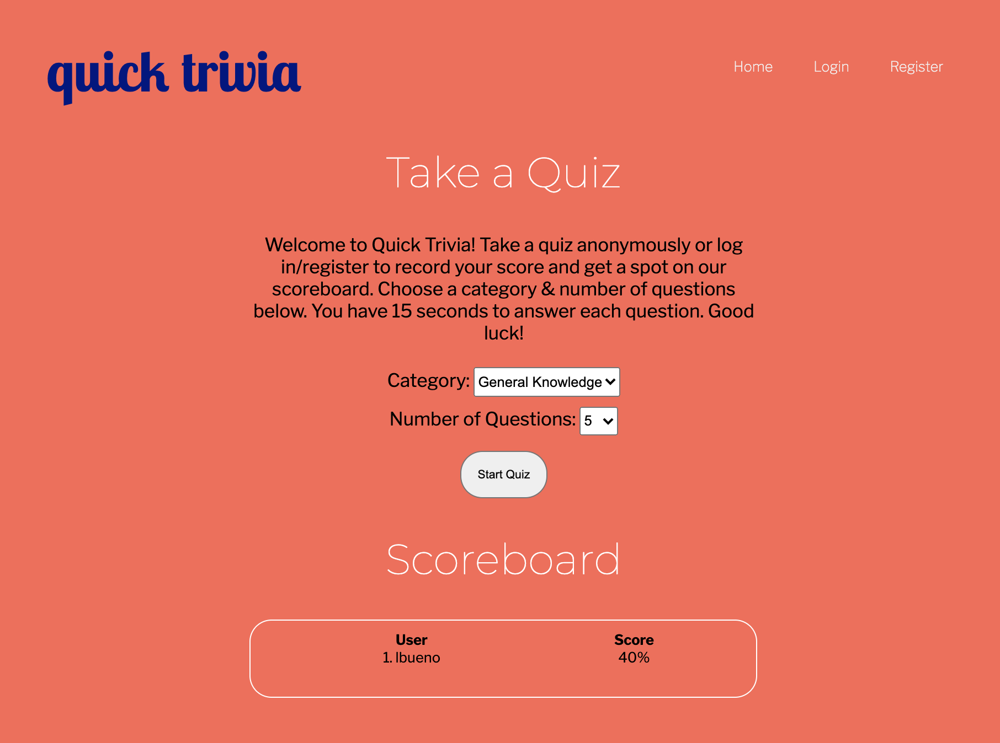
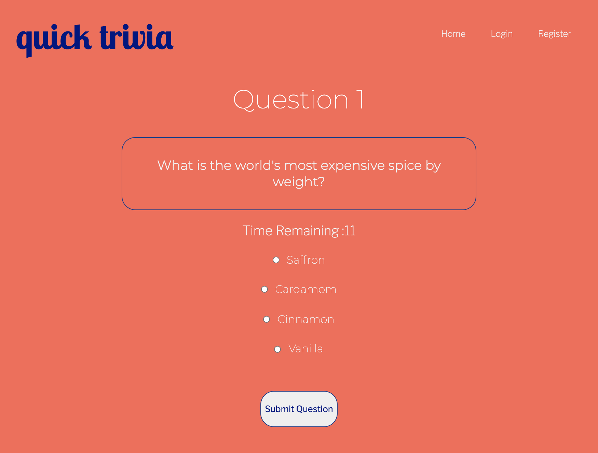
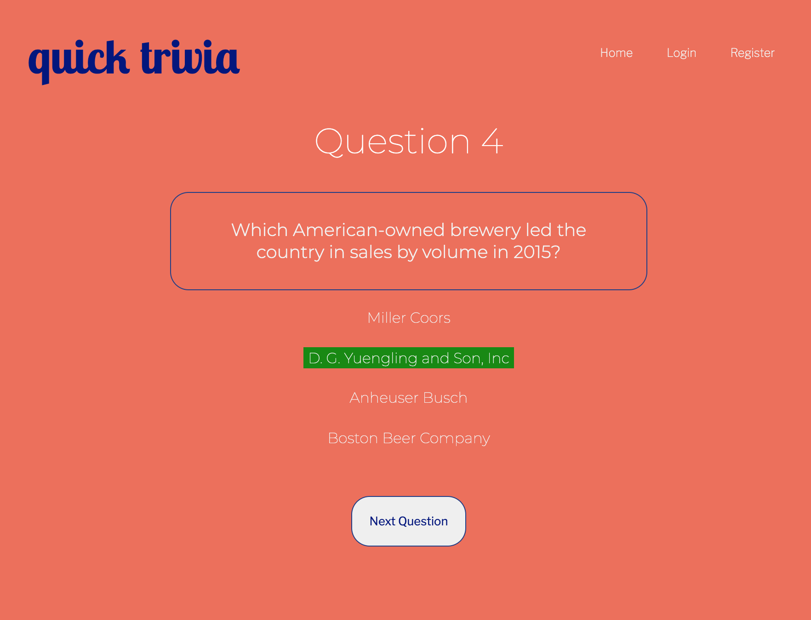
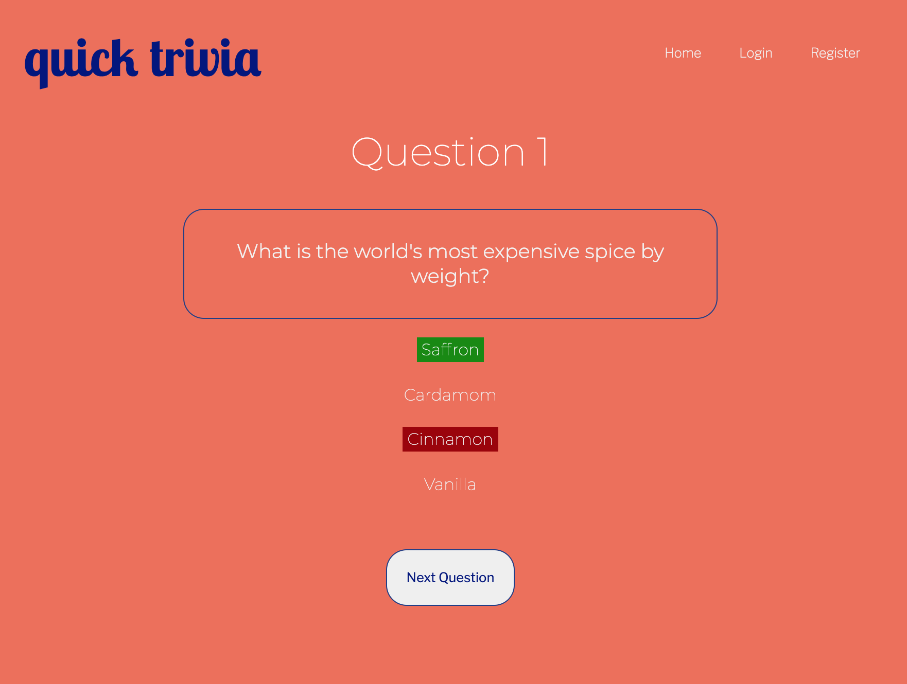
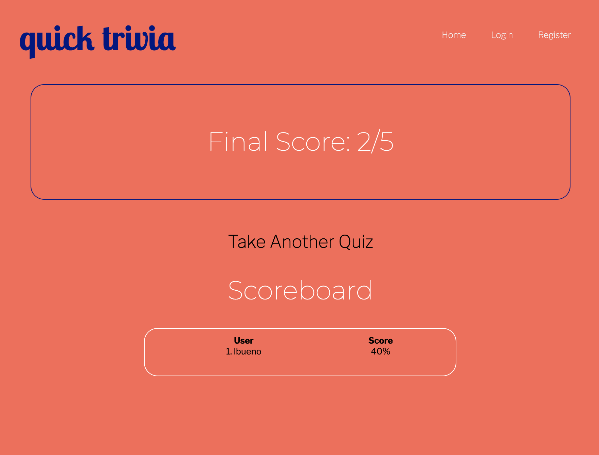
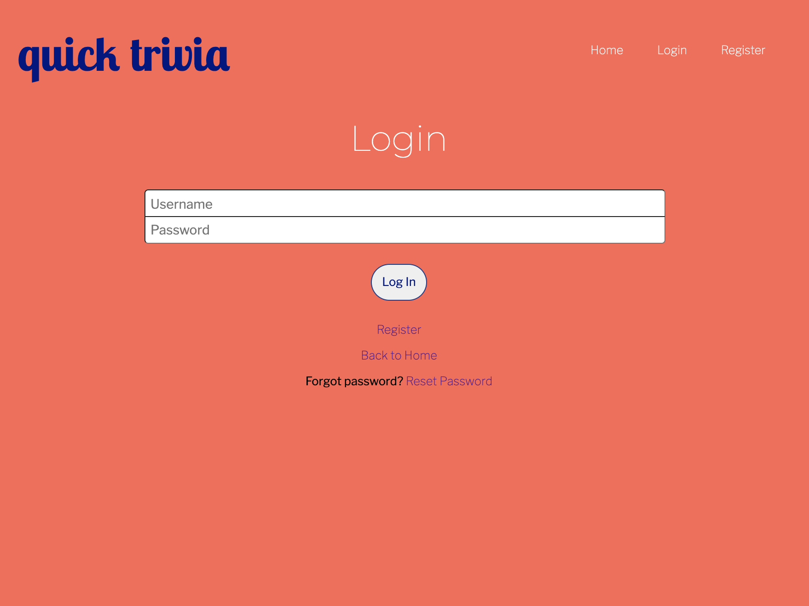
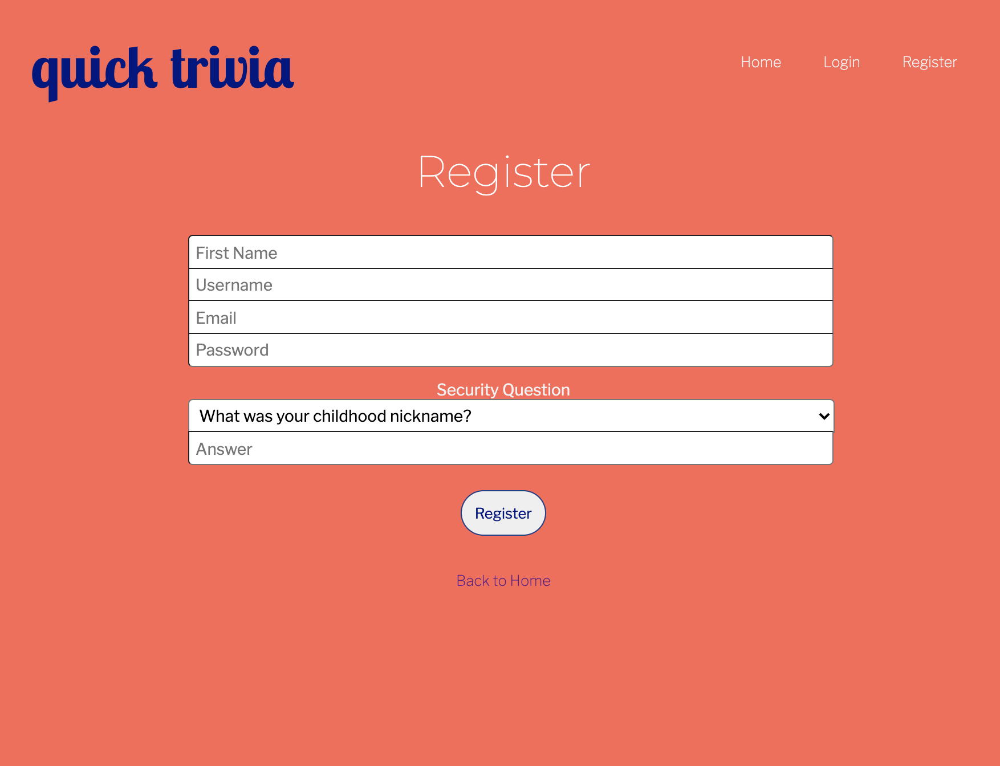
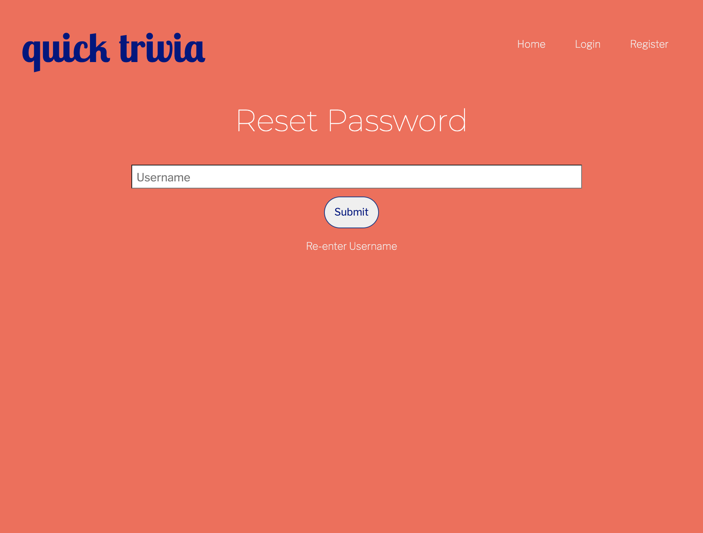
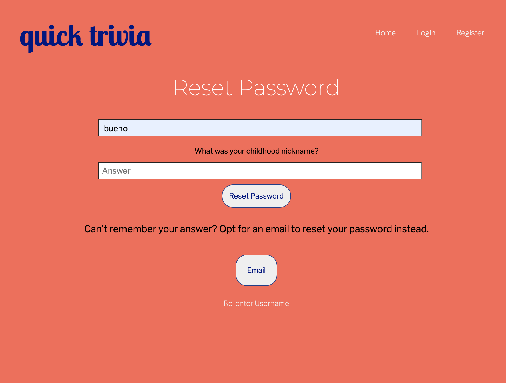
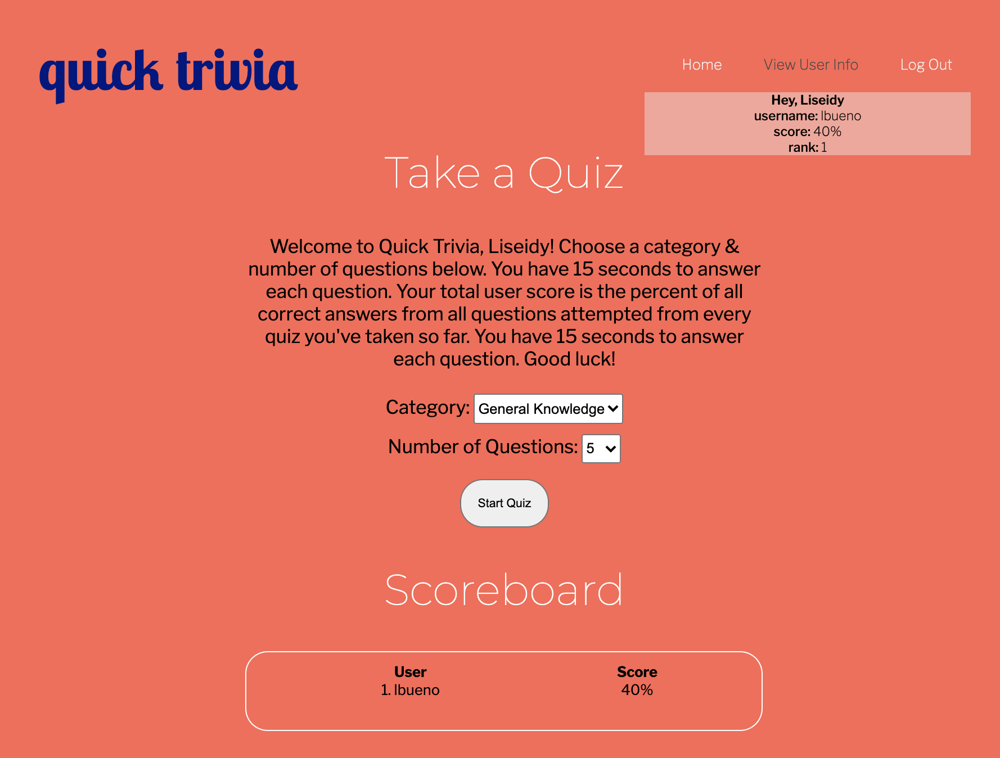

  <h3 align="center">QUICK TRIVIA</h3>

  

    Quick Trivia is a trivia app that uses an API from opentdb.com to search for questions and create a quiz in different categories from 5-20 questions. Users can create profiles to receive an overall rank for all quizzes they take.
     

<a href="https://quicktrivia.herokuapp.com/">View demo</a>

<h3 align="center>ABOUT THE PROJECT</h3>

Quick trivia is a Javascript project built using Node.js, Express, and EJS templates with a MySQL database. Users can register with their email addresses and are required to answer a security question. When logging in, if they've forgotten their password, they can elect to answer the security question or have an email sent to them. Both methods lead them to a page to create a new password. Users (both logged in and not) are able to select a category for each quiz and between 5 and 20 questions per quiz. If they are logged in, their number correct and total questions in that quiz are added to their total correct & total questions ever taken. This information is used to calculate a total score, which is put into a separate table. This table is used to create a scoreboard that can be viewed on the home page and score page. When a user is logged in, they can view their name, username, score, and ranking by hovering over "View User Info". Users have the ability to log out when desired.

<!-- GETTING STARTED -->
## Getting Started

This project was built using Node.js. All that is needed to run it is npm installation with express, body parser, and ejs.
Open localhost://8000 to view the app on your web browser. The MYSQL database is remote but can be changed to a local database if desired.
The email function uses google OAUTH2. You may either create a project using your own google OAuth2 credentials or
opt to use nodemailer locally without OAuth2.

<!-- CONTACT -->
## Developer CONTACT

If you have any questions, feel free to reach me at liseidybueno@gmail.com. 

<!-- SCREENSHOTS -->
## Images

Some images of the app in use:

 

 

 

 

 

 

 

 

 

 

